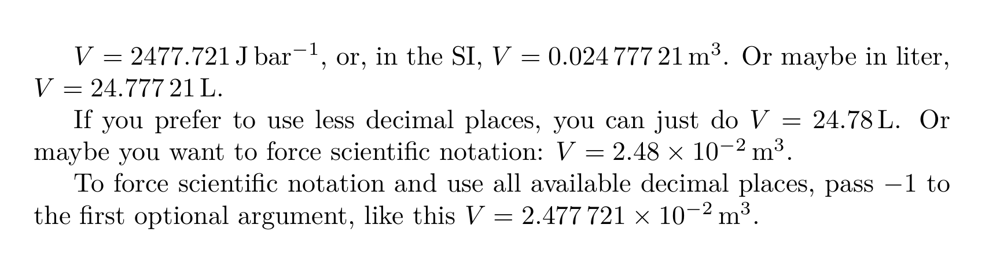

# `juliaunit`

LaTeX package to integrate Julia units and calculations (almost) seamlessly.

> This package has a long work until it first stable release, so use by your risk.

## Features

For now, `juliaunit` allows you to do calculations in Julia using [`Unitful.jl`](https://github.com/PainterQubits/Unitful.jl) to manage physical units and typeset it in LaTeX using [`siunitx`](https://ctan.org/pkg/siunitx), all directly in your LaTeX file.

You can:

-   Do calculation directly in Julia and typeset the result
-   Convert units in the pipe fashion
-   Print the value and the unit of anu `Unitful.Quantity`
-   Choose the number of decimal places
-   Force scientific notation

## How to Use

If you already have Julia and LaTeX installed and working, put `juliaunit.sty` in the same folder as your `.tex` file. Then compile with:

```sh
xelatex file.tex
pythontex file.tex
xelatex file.tex # again if needed
```

or any engine of your choice.

### Using arara

If you use [`arara`](https://ctan.org/pkg/arara), here a possible compilation recipe (add these lines to your LaTeX code):

```latex
% arara: xelatex: {interaction: nonstopmode} if changed('tex') || !exists('pytxcode')
% arara: pythontex
% arara: xelatex: {interaction: nonstopmode}
% arara: xelatex: {interaction: nonstopmode} while missing('pdf') || found('log', 'undefined references')
```

and compile with:

```sh
arara file.tex
```

Again, you can replace `xelatex` with any engine of your choice (see arara's docs).

## Examples

```latex
\documentclass{article}

\usepackage{juliaunit}

\begin{document}
    % Julia Code from Pythontex.
    \begin{jlcode}
        T = 298.0 * u"K";
        P = 1u"bar";
        n = 1u"mol";
        R = 8.3145 * u"J/mol/K";
        V = n*R*T/P;
    \end{jlcode}

    $ V = \jlunit{V} $, or, in the SI, $ V = \jlunit{V |> upreferred} $. Or maybe in liter, $ V = \jlunit{V |> u"L"} $.

    If you prefer to use less decimal places, you can just $ V = \jlunit[2]{V |> u"L"} $. Or maybe you want to force scientific notation: $ V = \jlunit[2][true]{V |> upreferred} $.

    To force scientific notation and use all available decimal places, pass -1 to the first optional argument, like this $ V = \jlunit[-1][true]{V |> upreferred} $.
\end{document}
```

And the result:


## How it works

This package actually hasn't nothing really new. It uses `pythontex` to run Julia from LaTeX, [Latexify.jl](https://github.com/korsbo/Latexify.jl) and [UnitfulLatexify.jl](https://github.com/gustaphe/UnitfulLatexify.jl) to print unities in LaTeX format. However, it lets you focus on your text and forget all these connections.

## Contributing

Any contribution is welcome. The project is structured in two main files, `juliaunit_template.sty` that provides LaTeX interface, and a `juliaunit.jl` that is the Julia side. However, the actual usable file is `juliaunit.sty`, which contains LaTeX and Julia code and is produced running `generate_sty.jl`.

To contribute, fork the repo, clone, and make your changes. Then run `generate_sty.jl`. Copy or symlink `juliaunit.jl` to your `texmf` or project folder. Test and submit your pull request!

## License

This project is under GPL v3.0-or-older license, which basically means that you can do everything except turn it into a private product.

## Author

Maintained by Heliton Martins.
